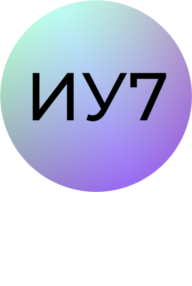
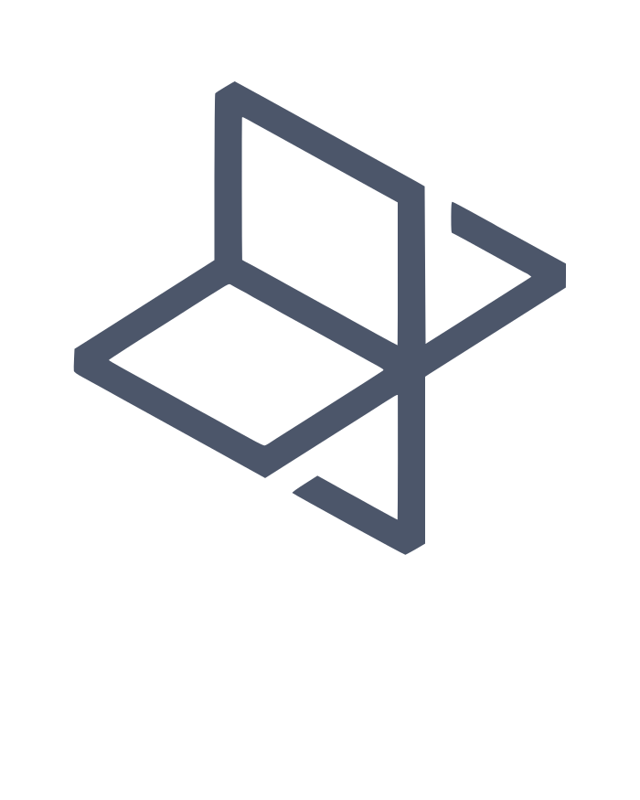
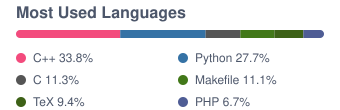
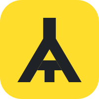

<h2 align="center">Yaroslav Ovchinnikov</h2>

  
  

<table width="100%">
<tr>
<th align="left" width="50%">About</th>
<th align="left" width="50%">Education</th>
</tr>
<tr>
<td valign="top">

Software engineer and ML enthusiast, pianist and tennis player.

Looking for ways to apply my skills in adjacent fields like biology and make the world a better place.

</td>
<td valign="top">

<code>BSc</code>&nbsp;&nbsp;&nbsp;&nbsp;Informatics and Computer Science, BMSTU

<code>MSc</code>&nbsp;&nbsp;<a href="https://cu.ru/master/science-school/biotech"><picture><source media="(prefers-color-scheme: dark)" srcset="assets/cu-pad-dark.svg"></picture></a>&nbsp;&nbsp;Biotech &amp; ML, Central University

</td>
</tr>
</table>

<table width="100%">
<tr>
<td valign="top" width="50%">
<b>Stack</b>
  

  
<b>Socials</b>
  

</td>
<td valign="middle" align="center" width="50%">

<picture>
  <source media="(prefers-color-scheme: dark)" srcset="assets/top-langs-dark.svg">
  
</picture>

</td>
</tr>
</table>

### Highlighted work

<table width="100%">
<tr>
<th align="left" width="22%">Project</th>
<th align="left" width="48%">Purpose</th>
<th align="left" width="30%">Stack</th>
</tr>
<tr>
<td valign="top">&nbsp;&nbsp;<a href="https://github.com/oolonge/hackathon-backend-bmstu-tbank-2026">tbank-hackathon</a></td>
<td valign="top">Hackathon-winning salary range prediction from a structured CV, team lead</td>
<td valign="top">  </td>
</tr>
<tr>
<td valign="top"><a href="https://github.com/oolonge/algorithmic-bacteria-classification">bacteria-classification</a></td>
<td valign="top">Graduation project: classifying bacteria in SEM images by staining pattern</td>
<td valign="top">  </td>
</tr>
<tr>
<td valign="top"><a href="https://github.com/oolonge/fridgefusion">fridgefusion</a></td>
<td valign="top">Recipe search by available ingredients, ranking substitutes when something is missing</td>
<td valign="top">  
  
  </td>
</tr>
<tr>
<td valign="top"><a href="https://github.com/oolonge/bmstu-computer-graphics-coursework">computer-graphics-coursework</a></td>
<td valign="top">3D Lego editor with a hand-written software renderer and shadow mapping</td>
<td valign="top"> </td>
</tr>
</table>
